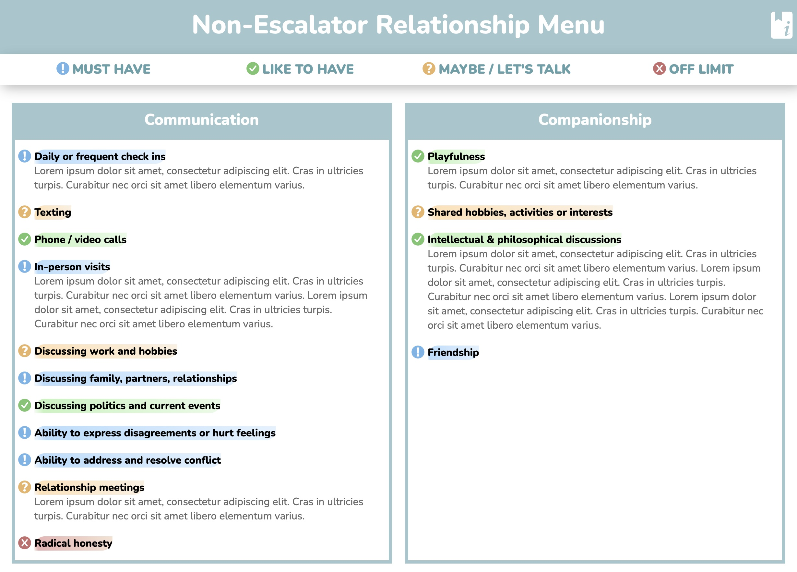

# Non-Escalator Relationship Menu

## [Demo](https://paviro.github.io/Non-Escalator-Relationship-Menu/)

This tool allows you to render a nice web page representation of a Relationship Menu you filled out with one or multiple partners / friends / colleagues / whatever.   

It is relatively easy to modify the categories and items included. To render a page you do need to edit some `json` files at the moment though so it might not be completely trivial to use for everyone.

## About Relationship Menus
Relationship menus are a great tool that can help you and another person get clear on what exactly you want to share in your relationship. This tool was heavily inspired by [this document](https://www.reddit.com/r/polyamory/comments/pwkdxp/v3_relationship_components_menu_last_update_for/) and the [The Relationship Anarchy Smorgasbord](https://drive.google.com/drive/folders/17Hc3UFkDX3qA4IGYmjxEQhMW9BUOdPxt). You can find a neat Podcast about the general concept [here](https://www.multiamory.com/podcast/339-the-smorgasbord-of-relationships).

## How to use it
### Preparing the data files
1. Enter the `databases` directory and duplicate the `example` folder. 
2. Name your new folder as you see fit, for example, after the people included in the menu. Inside the folder you find two files:
	1. `empty.json`: A blank template for a relationship menu.
	2. `filled_out.json`: The same document but filled with some placeholder data.
2. You can have multiple menu files in this folder (for example to keep a history of the changes). Each files does need to have a different `document_version` number, the file name is irrelevant to the script.
3. Look at both files to get a feel for how you need to fill them out. When you feel comfortable you can delete the `filled_out.json` rename the `empty.json` to something like `version_1.json` and start filling it out with another person.
#### Data schema
The data format for storing a menu currently looks like this:
```json
{
    "last_update": "2023-01-02T16:26:56.691002",
    "document_version": 1.0,
    "people": [
        "Person 1",
        "Person 2"
    ],
    "menu": [
        {
            "name": "Some Category",
            "items": [
                {
                    "name": "Some item in this category",
                    "icon": null,
                    "note": null
                },
                {
                    "name": "Some other item",
                    "icon": null,
                    "note": null
                }
            ]
        },
        {
            "name": "Some other category",
            "items": [
                {
                    "name": "Some item",
                    "icon": null,
                    "note": null
                },
                {
                    "name": "Another item",
                    "icon": null,
                    "note": null
                }
            ]
        }
    ],
    "schema_version": 1.0
}
```
##### Explanations
`last_update`: is a timestamp in ISO 8601 format.  
`document_version`: The revision of your menu. You can, for example, have an older version of your menu with an older version number (for example, 1.0) and a newer version with a higher version number (for example, 1.5) in two separate files that are then both viewable on the rendered web page.   
`people`: An array of the people that filled out the menu. Can also include more than two people.  
`menu`: An array containing the actual menu data, see below.   
`schema_version`: Version of the data schema used, you shouldn't need to change this.
###### Menu Array
- Possible values for `icon` are `must` | `like` | `maybe` | `off-limit` the default of `null` will render as a not filled out item.
- The `note` field allows you to add a note to an item, for example, to clarify what you have decided on.
### Rendering a menu
1. Your computer needs a Python 3 interpreter to use this tool.
2. Install the required libraries listed in `requirements.txt`
3. In the `main.py` file adjust the `RELATIONSHIP_MENU_PATH` variable. Change the part `example` to the name you gave your menu folder.
4. Execute the script in a terminal or in your IDE.
5. The `build` folder will include your rendered menu.

## Roadmap
Maybe I will add an option to actually edit the menus without having to edit json files at some point but if I am honest I probably wont... :D